# grmide (grm-web-ide)

터미널에서 AI로 개발할 때 쓰는 **브라우저 IDE**. 편집은 없고 읽기만 있다.

```bash
cd ~/work/my-project
grmide
```

브라우저가 열리고 현재 디렉토리의 변경사항이 뜬다. AI가 파일을 고치면 브라우저가
스스로 따라온다.

**참고 — 사용 화면**

<!--
  아래 URL 은 절대 마크다운으로 감싸지 마시오.

  GitHub 은 **맨 URL 한 줄**만 알아보고 <video> 플레이어로 바꿔 준다.
  `` 로 감싸면 깨진 이미지가 되고, <video> 태그를 직접 쓰면 새니타이저가
  지운다. raw.githubusercontent.com 주소나 상대 경로도 재생되지 않는다.
  자동재생·반복은 지정할 방법이 없다.

  영상 자체는 저장소에 없다 — GitHub 첨부로 올려 GitHub 이 호스팅한다. 원본
  화면 기록은 4K 31MB 라서 git 히스토리에 넣으면 모든 클론이 영구히 받게 된다.
  (첨부 한계: 무료 플랜 10MB · 유료 100MB / 형식 mp4·mov·webm)
-->

https://github.com/user-attachments/assets/d6a81f21-fef0-4494-9830-c956ac1699bd

git 뷰어로 시작했지만 지금은 그보다 넓다 — 코드를 읽고(⌘P·⌘⇧F), 히스토리를 보고,
AI가 방금 무엇을 바꿨는지 가려내고, 리뷰 코멘트를 AI에게 넘기는 일까지 한다.
그래서 이름이 `gitshow`에서 `grmide`로 바뀌었다.

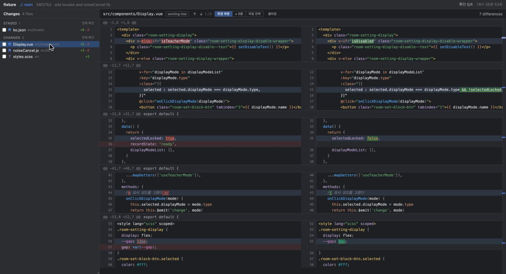

**IDE를 켜는 이유를 없애는 것**이 목표다. 그래서 기준선은 "편집이 없는 읽기 전용
IDE"다 — 코드를 읽고 찾는 일은 넓게 허용하고, 쓰기는 stage/commit까지만 한다.
편집기·터미널 임베드·원격 조작(push/pull/rebase)은 넣지 않는다.
자세한 범위 규칙은 [CLAUDE.md](CLAUDE.md) 참고.

> **처음이라면 [docs/ONBOARDING.md](docs/ONBOARDING.md)부터 읽으세요.** 왜 필요한지,
> AI와 한 사이클을 어떻게 도는지, 무엇을 기대하면 안 되는지가 10분 안에 정리됩니다.

## 검색 — Shift 두 번, ⌘P, ⌘⇧F

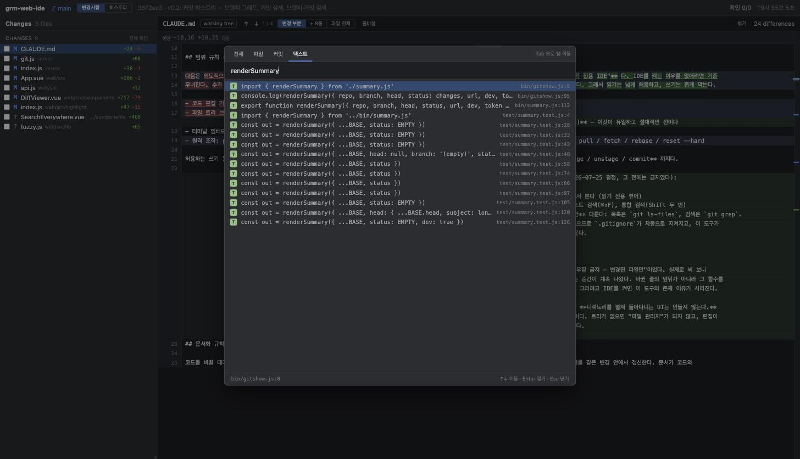

IntelliJ의 Search Everywhere처럼 **Shift를 두 번** 누르면 통합 검색창이 열린다.
`⌘P`는 파일 탭에서, `⌘⇧F`는 텍스트 탭에서 시작한다. `Tab`으로 탭을 옮긴다.

| 탭 | 찾는 것 | 어떻게 |
| --- | --- | --- |
| **전체** | 아래 셋을 한 번에 (종류별로 몇 개씩) | |
| **파일** | 경로 퍼지 매칭. `dvue` → `web/src/components/DiffViewer.vue` | `git ls-files` |
| **커밋** | 커밋 메시지 | `git log --grep` |
| **텍스트** | 저장소 전체 코드 | `git grep` |

- 파일을 고르면 **읽기 전용 뷰어**로 열린다. 문법 강조와 `⌘F`가 그대로 동작한다.
- 텍스트 결과를 고르면 그 파일의 **그 줄로 바로 이동**하고 잠깐 강조된다.
- 커밋 결과를 고르면 히스토리 탭으로 옮겨 그 커밋을 띄운다.
- `.gitignore`는 git이 지킨다 — `node_modules`가 결과를 덮지 않는다.

`⌘F`는 지금 보고 있는 diff나 파일 안에서 찾는다. 좌우 양쪽을 모두 훑고,
`Enter`/`Shift+Enter`로 매치 사이를 오간다.

드래그로 텍스트를 선택한 채 `⌘F`나 `⌘⇧F`를 누르면 그 텍스트가 검색어로
미리 채워진다 — 식별자를 보다가 바로 찾아 나설 수 있다.

검색은 **추적되지 않은 파일도 본다.** AI가 방금 만든 파일이 빠지면 가장 자주 찾을
것을 못 찾는다. `.gitignore`는 그대로 지켜진다.

### 디렉토리 트리

사이드바 변경사항 위에 저장소가 IDE처럼 트리로 보인다(접을 수 있다). 검색이
"아는 파일로 가는 길"이라면 트리는 "모르는 파일을 발견하는 길"이다 — 코드를 읽다
다른 파일을 따라갈 때 이름을 몰라도 도달할 수 있다. 한 번 누르면 미리 보기, 두 번
누르면 탭으로 붙잡는다. 목록은 `git ls-files` 기반이라 여기서도 `.gitignore`가
지켜지고, 파일이 새로 생기면 트리가 스스로 갱신된다.

키보드로도 다닌다 — `↑`/`↓`로 행을 오가고, `→`는 펼치기(펼쳐져 있으면 첫
자식으로), `←`는 접기(접혀 있거나 파일이면 부모로)다. IDE 트리의 관례 그대로다.

---

## 설치

Node 18 이상이 필요하다.

```bash
git clone git@github.com:sh-roomee/grm-web-ide.git
cd grm-web-ide

npm install
npm run build      # 프론트엔드 빌드 (web/dist)
npm link           # grmide 명령을 전역에 등록
```

`npm link` 없이 직접 실행해도 된다:

```bash
node /path/to/grm-web-ide/bin/grmide.js
```

> nvm으로 노드 버전을 바꾸면 `npm link`는 그 버전의 `bin`에만 등록되어 있다.
> 새 버전에서 쓰려면 다시 `npm link` 해야 한다.

## 사용법

```
grmide [경로] [옵션]

  -p, --port <번호>   시작 포트 (기본 4317, 사용 중이면 다음 포트로)
      --no-open       브라우저를 자동으로 열지 않는다
  -h, --help          도움말
```

경로를 주지 않으면 현재 디렉토리를 쓴다. **서브 디렉토리에서 실행해도 저장소
루트를 스스로 찾는다.** git 저장소가 아니면 그 사실을 알리고 종료한다.

실행하면 브라우저를 열기 전에 터미널에서 규모를 먼저 알 수 있다:

```
$ cd ~/work/my-project/src/components
$ grmide
grmide  my-project  ⎇ main
경로    /Users/me/work/my-project
HEAD    58f27b2 add locales and noiseCancel lib · 7 minutes ago
변경    4개 파일  +20 -11
        staged 1 · unstaged 2 · untracked 1

  M src/locales/ko.json         +9 -2 staged
  M src/components/Display.vue  +5 -7
  M src/lib/noiseCancel.js      +3 -2
  ? src/styles.scss             +3

주소    http://127.0.0.1:4317/?t=3f8a...
        파일이 바뀌면 브라우저가 스스로 따라온다. Ctrl-C 로 종료.
```

파일은 6개까지 보여주고 나머지는 `… 그 외 N개`로 줄인다. 바이너리 파일은 줄
수 대신 `바이너리`로 표시한다. 변경이 없으면 그렇게 알려주므로, 브라우저를 열
필요가 없다는 것도 바로 안다.

색은 터미널일 때만 넣는다. 파이프로 넘기거나 `NO_COLOR`가 설정되어 있으면 평문이다.

여러 저장소를 동시에 볼 수 있다. 포트가 이미 쓰이고 있으면 다음 번호로 넘어가므로
그냥 각 디렉토리에서 `grmide`를 치면 된다.

끝낼 때는 터미널에서 `Ctrl-C`. 브라우저 탭은 열어둔 채로도 종료된다.

---

## 화면

왼쪽 위 두 버튼으로 화면을 오간다. `Tab` 키로도 전환된다.

| 화면 | 보는 것 |
| --- | --- |
| **변경사항** | 지금 워킹트리에서 뭐가 바뀌었나 |
| **히스토리** | 뭐가 바뀌어 왔나 (커밋 그래프와 커밋 상세) |

### 문서 탭

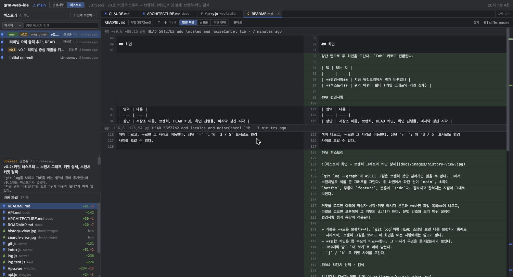

열어 본 것은 탭으로 쌓인다. 세 종류가 한 줄에 섞여도 아이콘으로 구분된다.

| 아이콘 | 무엇 |
| --- | --- |
| **M** | 워킹트리/staged 파일의 diff |
| **C** | 어떤 커밋 안의 파일 diff |
| **F** | 파일 내용 (읽기 전용) |

- **한 번 누르면 대신하고, 두 번 누르면 붙잡는다.** 목록에서 한 번 누르면 *미리 보기*로
  열려서(탭 이름이 기울임) 다음에 고른 것이 그 자리를 대신한다 — 훑어봐도 탭이 쌓이지
  않는다. **두 번 누르면** 그 자리에 붙잡혀 남는다. 탭 자체를 두 번 눌러도 붙잡힌다.
- 미리 보기는 **훑는 동작에만** 쓴다 — 목록에서 한 번 누르기와 `j`/`k`. `⌘P`·검색 결과·
  시트에서 여는 것은 이미 찾아서 연 것이라 **곧바로 붙잡힌다.** 문서 안 링크만 예외로
  미리 보기다(읽던 흐름을 따라가는 것이라).
- 같은 것을 다시 열면 새 탭이 생기지 않고 그 탭으로 간다.
- 내용은 탭에 담아 두므로 오갈 때 다시 받지 않는다. 워킹트리가 바뀌면 그 종류의
  탭만 낡은 것으로 표시하고, 실제로 볼 때 다시 받는다. 커밋과 파일은 확정된
  내용이라 건드리지 않는다.
- 커밋했거나 되돌려서 목록에서 사라진 파일의 탭은 자동으로 닫힌다.
- 12개가 넘으면 가장 오래 안 본 탭을 버린다.
- `⌥←` `⌥→` 이동, `⌥W` 또는 가운데 클릭으로 닫기, **`⌥⇧T`로 마지막에 닫은 탭 되살리기.**
  (`⌘W`·`⌘⇧T`·`⌘⇧[`는 브라우저가 쓴다 — 그래서 탭 단축키는 `⌥` 쪽에 모았다)
- 되살리기는 **붙잡은 탭만** 기억한다. 미리 보기로 스쳐 간 것까지 되살아나면 목록이
  지저분해진다. 자동으로 밀려난 탭과 커밋해서 사라진 탭도 대상이 아니다.

### 변경사항

| 영역 | 내용 |
| --- | --- |
| 상단 | 저장소 이름, 브랜치, HEAD 커밋, 확인 진행률, 마지막 갱신 시각 |
| 좌측 | 충돌 / Staged / Changes 그룹별 변경 파일 목록 (+추가 −삭제 줄 수) |
| 우측 | diff (나란히 · 한 줄), 문법 강조, 단어 단위 하이라이트, 변경 위치 눈금 |

위 스크린샷에서 좌측 목록을 보면 `ko.json`은 **STAGED**, `Display.vue`와
`noiseCancel.js`는 **CHANGES**, `styles.scss`는 `?` 표시(untracked)로 구분되어
있다. 한 파일이 일부만 stage된 경우 양쪽에 모두 나온다.

### 보기 방식 — 나란히 / 한 줄로

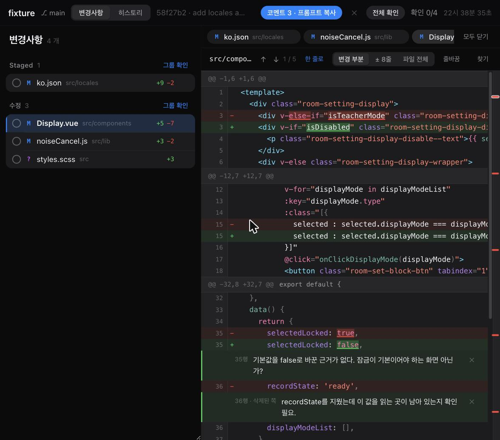

이 도구는 터미널 옆에 띄우는 것을 전제로 한다. 그 폭(700~900px)에서 좌우로 나란히
놓으면 컬럼 하나에 350px 남짓이 남아 양쪽이 다 잘린다. 그래서 상단 `한 줄로`를
누르면 `−` 줄과 `+` 줄을 한 컬럼에 순서대로 놓는다.

번호 컬럼은 **하나**다. 부호가 가리키는 쪽의 번호를 쓴다 — `−`는 HEAD 쪽 번호,
`+`와 문맥 줄은 지금 파일의 번호. 껍데기가 106px에서 60px로 줄고, 그 차이가 그대로
코드 폭이 된다.

**처음 열 때 창이 1100px보다 좁으면 한 줄 보기로 시작한다.** 한 번 고르면 그 값을
기억하므로, 창 크기 때문에 선택이 뒤집히지 않는다.

단어 단위 하이라이트 · ⌘F 찾기 · 변경 위치 눈금 · 코멘트는 두 보기 방식에서 똑같이
동작한다. 나란히 보기에서 왼쪽(삭제된 쪽)에 달아 둔 코멘트도 그 자리에 그대로
보인다.

### 보기 범위 — 변경 부분 / 파일 전체

상단에서 세 가지 중 고른다. 고른 값은 저장되어 파일을 옮기거나 다시 열어도 유지된다.

| 버튼 | 보이는 것 |
| --- | --- |
| **변경 부분** | 변경 주변 3줄만 (기본) |
| **± 8줄** | 변경 주변 8줄. 앞뒤 맥락이 조금 더 필요할 때 |
| **파일 전체** | 파일 전체를 보면서 변경된 곳을 확인 |

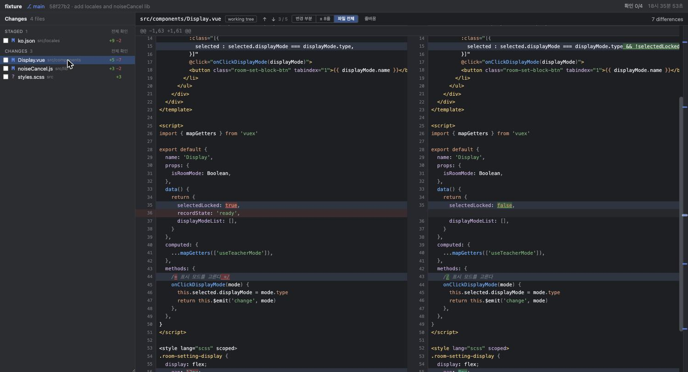

파일 전체 보기에서는 변경된 곳이 긴 내용 사이에 흩어진다. 그래서 **오른쪽
가장자리에 변경 위치를 눈금으로 찍었다** — 추가(초록)·삭제(빨강)·수정(파랑)으로
색이 다르고, 누르면 그 자리로 이동한다. 상단 `↑` `↓`와 `3 / 5` 표시로도 변경
사이를 오갈 수 있다.

### 이미지 — diff 대신 그림

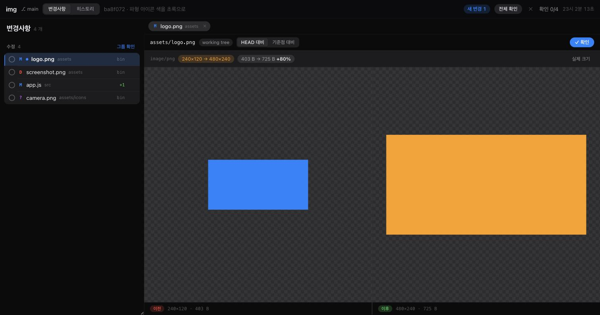

png을 바꾸면 `git diff`는 `Binary files differ` 한 줄을 준다. 터미널에서는 확인할
방법이 없어서 판단을 미루게 되는 구간이었다. 그래서 이미지는 **이전/이후를 나란히
그림으로** 보여준다.

지원 형식: `png` · `jpg` · `gif` · `webp` · `avif` · `bmp` · `ico` · `svg`.

- 투명한 부분이 보이도록 체크무늬를 깐다 — "투명"과 "그 색으로 칠해짐"은 다르다
- **픽셀 크기가 달라지면** 상단에 `240×120 → 480×240`으로 알린다. 레이아웃이 깨지는
  원인이라 diff 목록만 봐서는 알 수 없다
- **용량이 달라지면** `403 B → 725 B +80%`로 알린다. 몇 배씩 커지면 `×328`처럼 배수로
  쓴다. 에셋이 조용히 열 배가 되는 일은 실제로 자주 일어난다
- 추가된 파일은 한 쪽만, 지워진 파일도 한 쪽만 뜨고 그 사실을 말로 알려준다
- `실제 크기`를 누르면 축소 없이 1:1로 본다 (아이콘을 볼 때)
- **기준점 이후**를 누르면 기준점 시점의 그림과 비교한다 — AI가 에셋을 세 번 바꿨을
  때 마지막 한 번만 보는 길이다. 커밋 diff와 `⌘P` 파일 보기에서도 똑같이 동작한다

`svg`는 텍스트라 diff도 되므로 상단 `미리보기`로 그림 ↔ 텍스트 diff를 오간다.
기본은 그림이다. svg는 문서에 심지 않고 ``로만 그린다 — 문서에 직접 심으면 svg
안의 스크립트가 실행된다.

### 마크다운 — 문서는 그려서 읽는다

`.md`도 diff로 보면 `## 제목`과 `| a | b |`가 글자로 남는다. 문서를 검토할 때 정작
필요한 것이 그 모양이라 상단 `미리보기`로 **그려서** 본다.

- `⌘P`로 문서를 **읽으려고** 열면 그려진 쪽이 기본이다. **변경 목록에서 고르면 diff가
  기본이다** — 그때 알고 싶은 것은 "AI가 문서를 어떻게 바꿨나"이기 때문이다
- **코드 펜스는 diff와 같은 강조**를 쓴다. ` ```java `가 뷰어에서 보던 색 그대로 칠해지고
  `⌘+`/`⌘-`도 문서 안의 코드에 그대로 듣는다
- **문서 간 링크를 누르면 그 문서가 탭으로 열린다.** 상대 경로는 문서 위치를 기준으로
  푼다 (`docs/ROADMAP.md`의 `ARCHITECTURE.md` → `docs/ARCHITECTURE.md`)
- **`목차`로 절 사이를 오간다.** 제목이 셋 이상이면 상단에 버튼이 뜨고, 켜 두면 기억한다.
  지금 읽고 있는 절이 목차에서 강조된다. 좁은 폭에서는 목차가 스스로 숨는다 — 그 폭에서는
  본문이 먼저다
- `- [x]` 체크 항목을 그린다. 누를 수는 없다 — 읽기 전용이고, 고치는 일은 AI에게 시킨다
- 제목 · 문단 · 목록(중첩) · 표(정렬) · 인용 · 코드 펜스 · 구분선 · 강조 · 링크 · 그림

**HTML을 만들지 않는다.** `marked` 같은 라이브러리 대신 파서가 블록 트리를 내놓고 Vue가
요소로 그린다. `v-html`이 한 줄도 없으므로 문서 안의 `<script>`는 글자로 남는다 — 살균기로
막는 것이 아니라 그 자리가 없다. 그래서 아래는 **의도한 동작**이다.

- 원시 HTML(`<div>`, `<br>`)은 그려지지 않고 글자로 보인다. HTML 주석은 감춘다
- 맨 URL(`https://…`)은 자동으로 링크가 된다. 문장 끝 마침표와 감싼 괄호는 주소에서 뗀다
- `javascript:`·`data:` 링크는 링크가 되지 않고 글자만 남는다
- **저장소 안의 그림만 불러온다.** `https://…` 그림은 alt와 주소만 보여준다 — 문서를
  열었다는 사실이 그 서버로 새어 나가고, 이 도구는 "git이 보는 세계"에 머문다
- 원시 HTML을 그리지 않는 대신 **제목 이동은 직접 만들었다**: `#제목` 링크와 `목차`
  버튼으로 절 사이를 오간다. 앵커 규칙은 GitHub와 같아서(`#설계-결정`) 문서에 이미 적힌
  링크가 그대로 동작한다. `X.md#설계-결정` 처럼 다른 문서의 절도 바로 열린다

### 히스토리

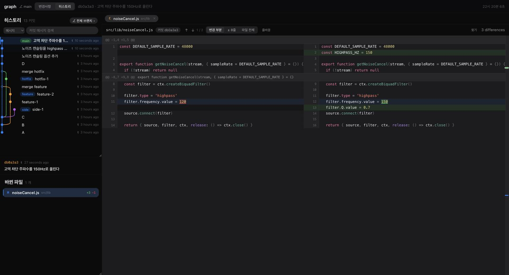

`git log --graph`의 ASCII 그림은 브랜치 셋만 넘어가면 읽을 수 없다. 그래서
브랜치별로 색을 준 그래프를 그린다. 위 화면에서 파란 선이 `main`, 초록이
`hotfix`, 주황이 `feature`, 분홍이 `side`다. 갈라지고 합쳐지는 지점이 그대로
보인다.

커밋을 고르면 아래에 작성자·시각·커밋 메시지 본문과 **바뀐 파일 목록**이 나오고,
파일을 고르면 오른쪽에 그 커밋의 diff가 뜬다. 문법 강조와 보기 범위 설정이
변경사항 탭과 똑같이 적용된다.

- 기본은 **모든 브랜치**다. `git log`처럼 HEAD 조상만 보면 다른 브랜치가 통째로
  사라져서, 브랜치 그림을 보려고 이 화면을 여는 사람에게는 쓸모가 없다.
- **병합 커밋은 첫 부모와 비교**한다. 그 머지가 무엇을 들여왔는지가 보인다.
- 100개씩 받고 `더 보기`로 이어 받는다.
- `j` / `k` 로 커밋 사이를 오간다.

#### 브랜치 선택 · 검색

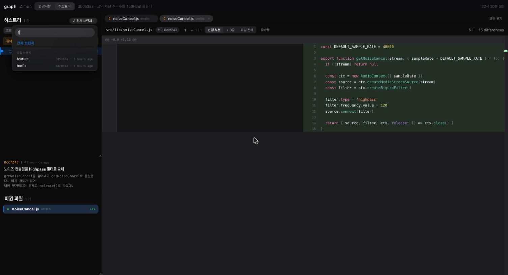

오른쪽 위 `⎇ 전체 브랜치` 를 누르면 브랜치 목록이 열린다. 열리면 바로 타이핑할 수
있어서, 브랜치가 많아도 이름 몇 자로 찾는다. 하나만 남았을 때 `Enter`로 고른다.

로컬 브랜치 · 원격 브랜치 · 태그가 최근 커밋 순으로 나오고, 각각 마지막 커밋의
해시와 시각이 붙는다. 현재 체크아웃된 브랜치에는 `HEAD` 표시가 붙는다.

브랜치를 고르면 그 브랜치의 히스토리만 본다. 태그를 골라 그 시점의 히스토리를 볼
수도 있다.

#### 커밋 검색

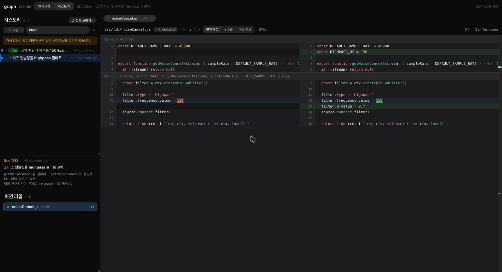

검색 대상을 골라서 찾는다.

| 대상 | 찾는 것 |
| --- | --- |
| **메시지** | 커밋 메시지 (기본) |
| **작성자** | 작성자 이름·이메일 |
| **코드 내용** | 이 문자열이 **생기거나 사라진** 커밋 = `git log -S`. "이 함수 누가 언제 지웠나" |
| **경로** | 이 경로를 건드린 커밋 |

검색 중에는 **브랜치 선을 그리지 않는다.** 걸러낸 목록은 앞뒤 커밋이 빠져 위상이
끊겨 있어서, 선을 그리면 사실과 다른 그림이 된다. 그 이유를 화면에도 한 줄로 알린다.

`Esc`로 검색어를 지운다.

### 문법 강조

언어별 플러그인 구조다. 지원: **js/ts · vue · html · css/scss · json · java**.
그 외 확장자는 색 없이 나온다.

`java`는 **애너테이션과 타입**을 따로 칠한다. 자바 한 줄은
`@Override public ResponseEntity<RoomDto> getRoom(@PathVariable Long id)` 처럼 수식어로
시작하는 일이 많아서, 키워드만 칠하면 어디가 타입이고 어디가 이름인지 구분되지 않는다.
`@…`는 한 덩어리로 떼고, `UpperCamelCase` 식별자는 타입으로 본다 — 자바는 관례가 강해
이 어림짐작이 거의 맞는다.

`.vue`는 한 파일 안의 `<template>` / `<script>` / `<style>`을 각각 다른 언어로
칠한다. 위 스크린샷에서 같은 파일의 템플릿·스크립트·스타일이 각각 다르게 칠해진
것을 볼 수 있다. Vue 디렉티브(`v-if`, `:class`, `@click`)의 값과 `{{ }}` 안쪽은
JS 식으로 칠하므로, `:class="[{ selected : a === b }]"`가 통째로 문자열이 되지 않는다.

색은 **전경색만** 쓴다. 배경색은 diff(추가·삭제·변경된 단어)가 쓰므로 두
하이라이트가 겹치지 않는다. 스크린샷의 `isTeacherMode` → `isDisabled` 처럼,
바뀐 단어에 배경색이 깔린 상태에서도 문법 색이 그대로 살아 있다.

언어를 추가하려면 `web/src/highlight/languages/`에 파일을 하나 만들어
`web/src/highlight/index.js`에 등록하고, `server/language.js`의 확장자 표에 같은
id를 넣는다. 규약은
[ARCHITECTURE](docs/ARCHITECTURE.md#문법-강조는-클라이언트-플러그인) 참고.

### AI가 방금 무엇을 바꿨나 — 기준점

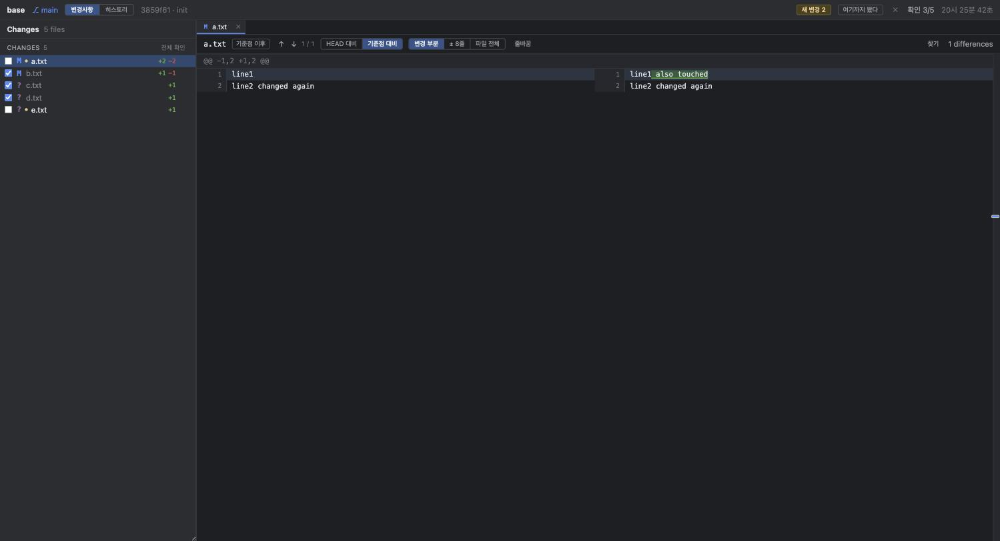

AI가 20분 동안 계속 고치는 동안 `git diff`는 매번 전체를 다시 보여준다. 이미 본
40개 파일과 새로 바뀐 3개가 구분되지 않는다. git에는 `HEAD`와 index만 있고
**"내가 마지막으로 확인한 시점"이라는 개념이 없기** 때문이다.

grmide는 그 시점을 만든다. 상단 `전체 확인`을 누르면 지금 워킹트리를 트리 객체로
굳혀 기준점으로 잡는다. 그 뒤로는:

| 표시 | 뜻 |
| --- | --- |
| **새 변경 3** | 기준점 이후 바뀌고 아직 확인하지 않은 파일 수. 누르면 그것만 보여준다 |
| **●** | 목록에서 그 파일이 새 변경임을 알린다 |
| **기준점 이후** | diff를 HEAD가 아니라 기준점과 비교한다 — **이미 확인한 변경은 컨텍스트로 내려가고 새로 바뀐 것만 변경으로 뜬다** |

위 스크린샷이 그 상태다. `line2 changed again`은 이미 확인했으므로 회색 컨텍스트로
내려가고, 새로 바뀐 `line1`만 변경으로 표시된다. `HEAD 대비`로 바꾸면 둘 다 보인다.

기준점은 `refs/grmide/baseline`에 매달아 두므로 grmide를 다시 켜도 유지되고,
`git gc`에도 사라지지 않는다. 사용자의 index나 커밋 히스토리는 건드리지 않는다.

### 확인 이후 — 파일마다 "내가 읽은 뒤"는 다르다

기준점은 워킹트리 **전체**를 한 순간에 굳힌다. 사람이 직접 잡아야 하고, 잡은 뒤에는
파일 40개가 한꺼번에 "기준점 이후"가 된다.

그런데 실제로는 파일마다 본 시점이 다르다. A를 읽고, AI가 A와 B를 고치고, B를 읽고,
AI가 다시 A를 고친다. 이때 알고 싶은 것은 "A에서 **내가 읽은 뒤** 무엇이 더 바뀌었나"다.
목록의 `●`는 *어느 파일*인지는 알려주지만 *무엇이* 바뀌었는지는 말해 주지 않는다.

그래서 `✓ 확인`을 누르면 **그때의 파일 내용도 함께 기록해 둔다.** 그 뒤로 상단에
`확인 이후`가 뜨고, 누르면 확인한 시점과 비교한다.

```
       HEAD 대비          확인 이후
       ─────────          ─────────
line1  + AI 1차 수정      (문맥으로 내려감)
line2  + AI 2차 수정      + AI 2차 수정      ← 내가 읽은 뒤 바뀐 것
```

- **기준점 잡기와 달리 따로 누를 것이 없다.** 어차피 누르던 `확인`이 그 시점이 된다
- 확인 표시가 자동으로 풀려도(파일이 또 바뀌어서) 기록은 남는다 — 그래야 "확인 이후
  무엇이 바뀌었나"에 답할 수 있다
- **한 번도 확인하지 않은 파일에는 이 선택지가 뜨지 않는다.** 기준이 없으면 파일 전체가
  새로 추가된 것처럼 보이기 때문이다
- 기록은 `refs/grmide/seen`에 트리로 매달아 둔다. 기준점과 같은 방식이라 `git gc`에도
  사라지지 않고, index와 커밋 히스토리는 건드리지 않는다

### 확인 — 파일 하나씩 넘기기

파일을 열면 상단에 **`✓ 확인`** 버튼이 뜬다(아직 확인하지 않은 새 변경일 때).
누르면 **다음 새 변경 파일로 자동으로 넘어가고** `남은 N`이 줄어든다. 파일 44개를
훑을 때 필요한 건 이 반복뿐이다. `space` 키로도 된다.

- 파일마다 체크박스로 직접 표시할 수도 있다. 상단에 `확인 3/12`로 진행률이 뜬다.
  진행률은 저장소 옆(`<git-dir>/grmide-state.json`)에 저장되어 브라우저를 닫거나
  grmide가 다른 포트로 떠도 남는다.
- **그 파일이 다시 바뀌면 체크가 자동으로 풀린다** — 이미 본 내용이 아니기 때문이다.
- 그룹 헤더의 `그룹 확인`은 그 그룹을 한 번에 표시한다.
- 상단 `전체 확인`은 모두 확인 처리하고 기준점을 새로 잡는다.

### 코멘트 — 리뷰를 AI에게 넘기기

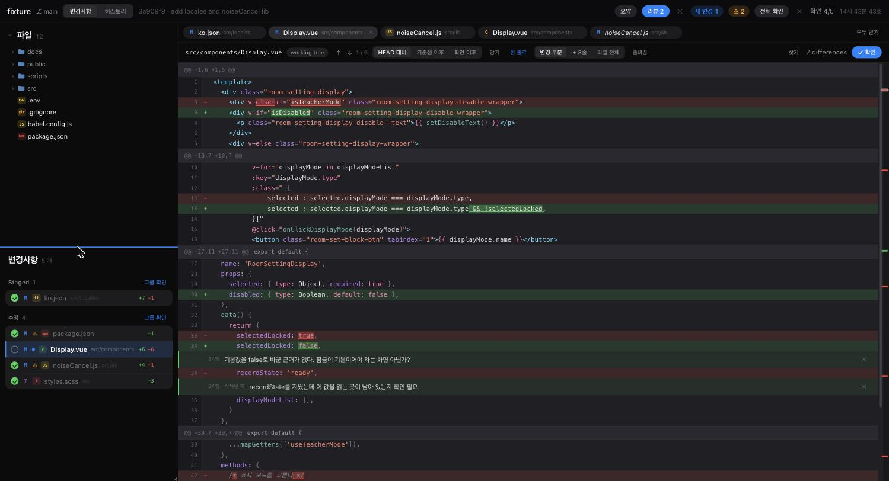

지금까지 리뷰는 이렇게 끊겼다: 브라우저에서 diff를 보고 → 머릿속에 기억 →
터미널로 가서 **경로와 줄 번호를 다시 타이핑.**

**줄 번호를 클릭하거나 여러 줄을 끌어서** 코멘트를 단다(`⌘Enter` 저장, `Esc` 취소).
범위로 고르면 "이 블록 전체를 왜 이렇게 바꿨어?"를 물을 수 있고, 프롬프트에는
`code.js:3-6`처럼 범위가 적히고 그 줄들이 모두 들어간다.

삭제된 쪽(왼쪽)에도 달 수 있어서 "이 줄은 왜 지웠어?"를 물을 수 있다.

상단 **`리뷰 N`** 을 눌러 스레드를 열고 보낼 것을 고른 뒤 `선택 N개 · 프롬프트 복사`를
누르면 이런 형태로 클립보드에 담긴다:

````
아래 리뷰 코멘트를 반영해줘.

## a.txt

### a.txt:1
```text
line1
```
이 줄은 왜 지웠어?

### a.txt:2
```text
line2 changed again
```
v3로 바꾼 이유가 뭐야?
````

터미널에 붙여넣기만 하면 된다. 경로·줄 번호·**그때 본 코드**가 함께 들어가므로
AI가 위치를 정확히 찾는다.

코멘트는 `<git-dir>/grmide-state.json`에 저장되어 새로고침과 grmide 재시작에도
남는다. 워킹트리에 파일을 만들지 않으므로 변경 목록을 오염시키지 않는다.

### 텍스트 선택과 복사

side-by-side diff에서 **한쪽 컬럼만 선택된다.** 드래그를 시작한 쪽만 잡히므로
복사해도 좌우가 섞이지 않고, 줄 번호도 따라오지 않는다. 그대로 `⌘C`로 복사해서
어디든 붙여넣을 수 있다.

#### 리뷰 스레드 — 모아 보고, 골라 보내고, 되짚기

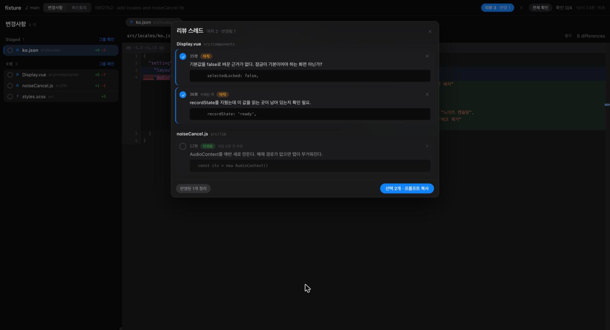

상단 `리뷰 N`을 누르면 코멘트가 파일별로 모인다. 지금까지는 파일을 열어야 그 파일의
코멘트가 보였고, 복사는 늘 전부 한꺼번에였다.

**보낼 것만 고른다.** 체크된 것만 프롬프트에 담긴다. 열 때 "아직"인 것이 자동으로
골라지므로 대개 그대로 누르면 된다.

**반영됐는지 되짚는다.** 코멘트를 쓸 때 함께 저장해 둔 코드 조각이 지금도 파일에
있는지로 판정한다.

| 표시 | 뜻 |
| --- | --- |
| **아직** | 그때 본 코드가 아직 그대로다 |
| **반영됨** | 그 코드가 바뀌었다 — AI가 손댄 것으로 보인다 |
| **커밋** | 커밋에 단 코멘트라 판정하지 않는다 (커밋 내용은 바뀌지 않는다) |

줄 번호가 아니라 **코드 조각**으로 찾기 때문에 위쪽이 바뀌어 줄이 밀려도 따라간다.
삭제된 쪽에 단 코멘트는 방향이 뒤집힌다 — 지운 코드가 되살아나면 반영된 것이다.

판정은 어림짐작이다. AI가 코드를 그대로 두고 "확인했고 문제 없다"고 답한 경우는 알
수 없다. 그래서 화면도 단정하지 않고 표시만 하며, 지우는 것은 사람이 정한다
(`반영된 N개 정리`).

### 사이클 요약 — 다음 지시를 쓰기 전에

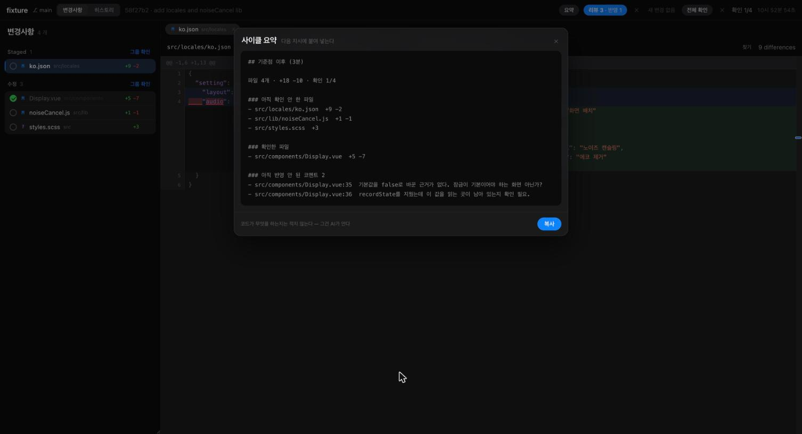

상단 `요약`을 누르면 **기준점 이후 무슨 일이 있었는지**가 한 장으로 나온다. 읽어 보고
`복사`로 다음 지시에 붙여 넣는다.

```
## 기준점 이후 (22분)

파일 4개 · +18 −10 · 확인 1/4

### 아직 확인 안 한 파일
- src/locales/ko.json  +9 −2
- src/lib/noiseCancel.js  +1 −1

### 확인한 파일
- src/components/Display.vue  +5 −7

### 아직 반영 안 된 코멘트 2
- src/components/Display.vue:35  기본값을 false로 바꾼 근거가 없다…
```

**코드가 무엇을 하는지는 적지 않는다.** 그건 터미널의 AI가 이미 안다. 대신 AI가 알 수
없는 것을 모은다 — 사람이 무엇을 확인했고, 무엇이 남았고, 어떤 코멘트가 아직 반영되지
않았고, 어디에 위험 신호가 붙었는지. 그래서 `git diff --stat`과 겹치지 않는다.

### 컨텍스트 담기 — "이것도 같이 봐"

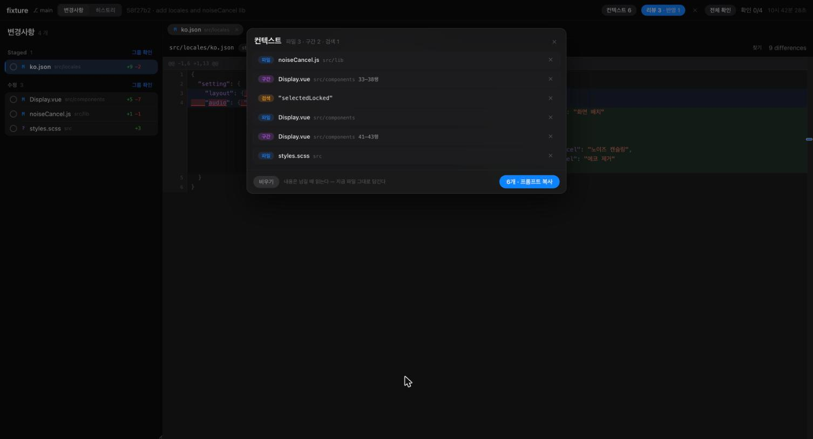

코멘트가 **판단**을 넘기는 길이라면, 이쪽은 **읽을 곳**을 넘기는 길이다. 지금까지는
"이 파일도 같이 봐"를 하려고 터미널에 경로를 손으로 쳤다.

담는 자리는 셋이고, 모두 이미 그 대상을 보고 있는 자리다.

| 자리 | 담기는 것 |
| --- | --- |
| diff 위 **`담기`** | 지금 보고 있는 파일 |
| 줄을 끌어 고른 뒤 **`구간 담기`** | 그 구간 (줄 번호가 붙어서 담긴다) |
| 검색 결과에서 **`⌥Enter`** | 그 결과의 파일. 창은 닫히지 않아 이어서 담을 수 있다 |
| 텍스트 검색의 **`검색 담기`** | 검색어 자체 |

상단 `컨텍스트 N`을 눌러 담긴 것을 보고 `프롬프트 복사`로 넘긴다.

**내용은 담을 때가 아니라 넘길 때 읽는다.** 담아 둔 내용을 얼려 두면 AI가 고친 뒤에
프롬프트가 사실과 달라진다. 같은 이유로 검색어는 결과가 아니라 검색어를 담고, 넘길
때 다시 검색한다. 600줄이 넘는 파일은 자르고 **잘랐다고 프롬프트에 적는다** — 감추면
AI가 "여기 없다"를 근거로 잘못 판단한다.

### 놓치기 쉬운 지점 표시

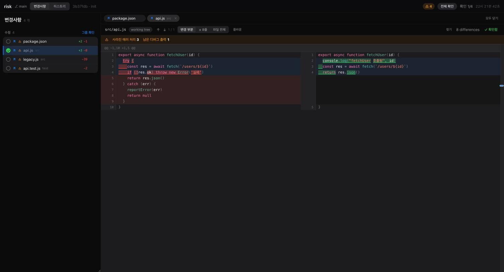

리뷰에서 위험한 것은 새로 들어온 코드보다 **조용히 사라진 것**이다. 추가된 줄은 눈에
띄지만 지워진 테스트나 없어진 에러 처리는 파일 수십 개를 훑는 동안 그냥 지나간다.

| 신호 | 무엇을 보는가 |
| --- | --- |
| **삭제된 테스트** | 테스트 파일에서 사라진 `it`/`test`/`assert` |
| **사라진 에러 처리** | 없어진 `try`/`catch`/`throw`/`.catch(` |
| **남은 디버그 출력** | 새로 들어온 `console.log`/`debugger`/`print(` |
| **의존성 변경** | `package.json`·lock 파일 |
| **크게 지워짐** | 30줄 이상 지워지고 추가가 그 1/4 미만 |

상단 `⚠ 4`는 그런 파일이 4개라는 뜻이고, 누르면 **그 파일만** 본다. 목록의 ⚠에 마우스를
올리면 무슨 신호인지 나오고, 파일을 열면 diff 위에 띠로 붙는다.

**린터가 아니다.** 판정을 내리지 않고 개수와 예시만 보여준다 — 판단은 사람이 한다.
잡음을 줄이려고 이런 것들을 걸러낸다: 에러 처리가 추가된 쪽에도 있으면 옮긴 것으로 보고,
`describe`/`it`은 테스트 파일에서만 세고, 삭제가 커도 추가가 비슷하면 옮긴 것으로 본다.

### 실시간 갱신

파일이 바뀌면 서버가 브라우저에 알린다(SSE). 창에 포커스를 줄 필요도, 새로
고칠 필요도 없다. 터미널에서 `git add` 한 것도 즉시 반영된다.

grmide를 끄면 상단에 **"연결 끊김"** 이 뜬다. 서버가 죽었는데 옛 내용이 그대로
보이면 지금 상태로 착각하기 때문이다. 다시 켠 뒤 **"다시 연결"** 을 누르면 이어진다.

### stage / unstage

목록에서 파일에 마우스를 올리면 오른쪽에 `+` / `−` 가 나온다. `+`는 `git add`,
`−`는 `git reset HEAD`다.

`push` · `pull` · `rebase` · `reset --hard` 같은 원격·이력 조작은 넣지 않았다.
터미널이 더 빠르고, 잘못 누르면 되돌리기 어렵다.

### 단축키

| 키 | 동작 |
| --- | --- |
| `Shift` `Shift` | 통합 검색 (파일 · 커밋 · 텍스트 한 번에) |
| `⌘P` | 파일 열기 |
| `⌘⇧F` | 저장소 전체 텍스트 검색 (선택한 텍스트가 있으면 그것으로) |
| `⌘F` | 지금 보고 있는 파일에서 찾기 (선택한 텍스트가 있으면 그것으로) |
| `⌘+` / `⌘-` | 코드 글자 크기 (11–17px) — `⌘0` 으로 기본값(12.5px) |
| `Tab` | 변경사항 ↔ 히스토리 전환 |
| `⌥←` / `⌥→` | 이전 / 다음 문서 탭 |
| `⌥W` | 현재 탭 닫기 |
| `⌥⇧T` | 마지막에 닫은 탭 되살리기 (`⌘⇧T`는 브라우저가 쓴다) |
| `j` / `k` | 다음 / 이전 (변경사항에서는 파일, 히스토리에서는 커밋) |
| `space` | 현재 파일을 "확인함"으로 토글 |
| `Esc` | 열린 것 닫기 (검색창 · 읽기 전용 파일 탭) |

변경 사이 이동은 상단의 `↑` `↓` 버튼이나 오른쪽 눈금을 쓴다(아직 키 할당 없음).

---

## 개발

```bash
npm run dev     # 서버(4317) + vite dev server(5173) 동시 실행
npm test        # diff 파서 · 문법 강조 테스트
npm run build   # 배포용 프론트엔드 빌드
```

`npm run dev`는 현재 디렉토리를 대상 저장소로 잡는다. 다른 저장소를 보려면
서버와 프론트를 따로 띄운다:

```bash
GRMIDE_DEV=1 node bin/grmide.js ~/work/other-project --no-open --port 4317
npm run dev:web
```

dev 서버가 출력한 토큰을 붙여 `http://localhost:5173/?t=<토큰>` 으로 접속한다.

구조와 설계 판단은 [ARCHITECTURE](docs/ARCHITECTURE.md)에 정리되어 있다.
코드를 바꿀 때 어떤 문서를 함께 갱신해야 하는지는 [CLAUDE.md](CLAUDE.md)에 있다.

## 보안

저장소 내용을 그대로 노출하는 서버이므로:

- **`127.0.0.1`에만 바인딩한다.** 외부 바인딩 옵션은 제공하지 않는다.
- 실행마다 임의 토큰을 만들고 `/api/*` 전체에 요구한다. 같은 머신의 다른
  프로세스나, 브라우저에서 열어둔 아무 웹사이트가 마음대로 붙지 못한다.
- 토큰은 URL로 한 번 전달된 뒤 즉시 `sessionStorage`로 옮기고 주소창에서 지운다.
  주소를 복사해 공유하는 사고를 막는다.
- 저장소 밖 경로 요청은 서버에서 거부한다.
- git 명령은 항상 인자 배열로 실행한다(셸 미경유). 경로나 브랜치명에 공백이나
  특수문자가 있어도 안전하다.

## 알려진 한계

- 가상 스크롤이 없다. 파일 하나의 diff가 20,000행을 넘으면 잘라내고 그 사실을
  화면에 알린다.
- 문법 강조가 줄 단위다. 여러 줄 주석이나 템플릿 리터럴은 가끔 틀리게 칠해진다.
- 다크 테마만 있다.

## 다음 단계

커밋·hunk 단위 stage → 파일 히스토리·blame → 충돌 해결 UI → 심볼·액션 검색
순서다. 자세한 내용은 [ROADMAP](docs/ROADMAP.md).

## 문서

- [docs/ONBOARDING.md](docs/ONBOARDING.md) — **처음 받은 사람용.** 왜 쓰는지와 작업 흐름
- [docs/ARCHITECTURE.md](docs/ARCHITECTURE.md) — 구조와 설계 결정
- [docs/API.md](docs/API.md) — HTTP API
- [docs/ROADMAP.md](docs/ROADMAP.md) — 진행 상황과 다음 단계
- [CLAUDE.md](CLAUDE.md) — 작업 규칙 (범위 / 문서화)
